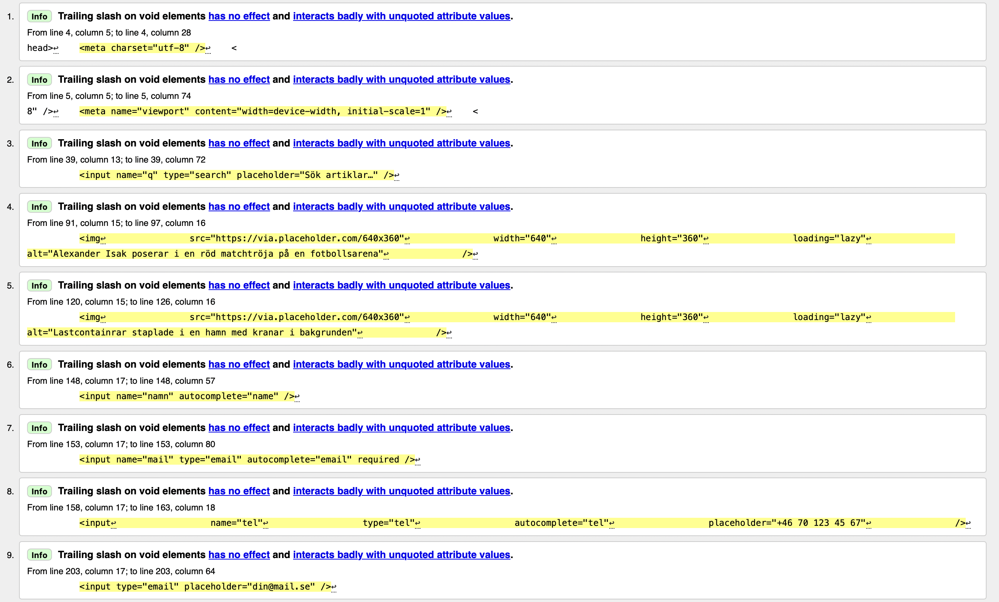

# INL 1 html

Inlämningsuppgift 1 html
Dag 1
Estimerad tid = 6 timmar
Verklig tid = 11 timmar ~
Start 09-04-25 kl 12.30 till 09-04-25 23.40~
Rast mellan 15.00-16.00
Dag 2
Estimerad tid = 5 timmar
Verklig tid = 1,5 timmar
Start 09-05-25 19.00 till 09-05-25 20.30

Todo-List

- [ ] Sätta upp grundstrukturen för sidan (doctype, html, head, body) – 1,5 SP
- [ ] Lägga till header med logga och navigation – 2 SP
- [ ] Skapa huvudartikel med rubrik och text – 1 SP
- [ ] Lägga till sektion för senaste artiklar – 2 SP
- [ ] Skapa formulär för “Tipsa redaktionen” – 1,5 SP
- [ ] Göra en footer – 0,5 SP
- [ ] Tillgänglighetsgranska koden (labels, alt-texter, rubriknivåer) – 1 SP

Sammanfattning: Detta är första gången jag kodat html och tyckte att det var rätt svårt men efter ett litet tag så "börja" man fatta mer och mer. Känner 100% att jag behöver lägga mer tid på att förstå programmeringsspråken och vad olika taggar gör! Hade uppskattats om du Jenni hade kunnat dela med dig om vart man kan lära sig grunderna av kodning, tex någon speciel sida, Youtuber och så vidare. Har också lärt mig att ai hittar små små misstag som man själv aldrig kanske skulle hitta. Lärt mig att jag bör commita oftare så att saker inte försvinner. Dag 2 behövde jag skriva om min README.md för att jag inte hade commitat den och skriva om min kod på grund utav samma sak.

